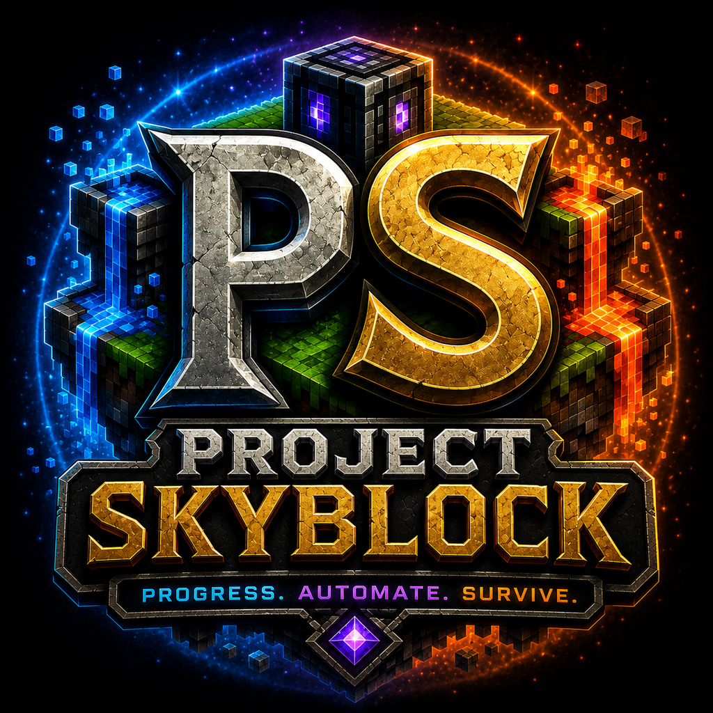

<p align="center">
  
</p>

<h1 align="center">Project Skyblock</h1>

<p align="center">
  A standalone Skyblock progression and automation mod for Minecraft 1.21.1 on NeoForge.
</p>

<p align="center">
  <a href="https://www.curseforge.com/minecraft/mc-mods/project-skyblock"></a>
  <a href="https://github.com/raziel23x/Project-Skyblock"></a>
  <a href="https://github.com/raziel23x/Project-Skyblock/issues"></a>
  
  
  
  
</p>

## Progress. Automate. Survive.

Project Skyblock expands the gameplay **after** a Skyblock world has been created. It is not a world generator; dedicated mods already handle that job well.

The mod focuses on resource generation, progression, automation, equipment, reusable crafting tools, configurable mechanics, and optional integrations. Project Skyblock works as a standalone mod and enables extra compatibility only when supported mods are installed.

## Downloads

- [CurseForge](https://www.curseforge.com/minecraft/mc-mods/project-skyblock)
- [GitHub releases and source](https://github.com/raziel23x/Project-Skyblock)
- [Issue tracker](https://github.com/raziel23x/Project-Skyblock/issues)

## Current Features

| System | Status | Details |
|---|:---:|---|
| Repair Gem | ✅ | Passively repairs carried equipment |
| Curios integration | ✅ | Optional Repair Gem slot support |
| Resource Generators | ✅ | Cobblestone, water, and lava |
| Generator automation | ✅ | Item/fluid capabilities and upward item output |
| Flint equipment | ✅ | Tools, shears, and armor |
| Wooden equipment | ✅ | Armor and shears |
| Reagent items | ✅ | Red, green, and blue |
| Reagent blocks | ✅ | Storage blocks with matching particles |
| Mixing Bowl | ✅ | Reusable crafting foundation |
| Material Crusher | ✅ | Data-driven FE/fuel processing with active exterior gears and vent effects |
| Thermal Generator Mk I | ✅ | Solid-fuel/lava generation with internal FE buffer and active exterior animation |
| Basic Energy Cable (slim blue conduit with industrial connectors) | ✅ | Standalone FE transport using NeoForge capabilities |
| Recipe progression | 🚧 | Being expanded through datapack-driven systems |

## Repair Gem

The Repair Gem gradually repairs damaged equipment while carried.

- Works from the normal inventory, armor slots, and offhand
- Supports a Curios slot when Curios is installed
- Never scans the Ender Chest
- Requires no repair bench or machine
- Emits a subtle magical aura when dropped
- Repair interval and amount are configurable

## Resource Generators

### Cobblestone Generator

- Stores up to 64 cobblestone by default
- Supports manual collection
- Automatically inserts into a compatible inventory above
- Exposes an extraction-only item capability
- Works with compatible pipes, storage blocks, drawers, and backpacks

### Water Generator

- Stores 8,000 mB by default
- Supports bucket extraction
- Exposes an extraction-only fluid capability
- Works with compatible pipes and tanks

### Lava Generator

- Stores 8,000 mB by default
- Supports bucket extraction
- Exposes an extraction-only fluid capability
- Works with compatible pipes and tanks

All generators include placed-block and dropped-item particle effects. Capacity, speed, extraction, automation, and particles are configurable.


## Machines and Power

### Material Crusher

- Uses the clean registry ID `projectskyblock:material_crusher`
- Processes datapack-driven crushing recipes
- Uses FE first and furnace fuel as fallback
- Supports strict sided item automation
- Includes an animated GUI, FE gauge, fuel display, and processing effects
- Shows its active state in-world through rotating side-cog frames, a glowing front chamber, front material dust, and rear vent smoke/ash
- Includes optional Ex Deorum dust support when Ex Deorum is installed

### Thermal Generator Mk I

- Shows its working state with a rotating front turbine, full-panel rear exhaust grille with an animated cooling fan, glowing firebox, full-width exhaust smoke emitted from inside the grille, a subtly pulsing firebox glow, and heat particles
- Converts standard furnace fuels into stored lava-equivalent millibuckets
- Accepts lava through the standard NeoForge fluid capability
- Generates FE into an internal output buffer
- Pushes FE into adjacent receivers
- Preserves queued solid-fuel conversion, tank contents, and stored FE

### Basic Energy Cable

- Connects automatically on all six sides
- Links connected cable blocks into one FE network
- Pulls from standard NeoForge FE sources and distributes to receivers
- Uses a configurable network transfer limit
- Contains no item or fluid transport functionality

## Reagents and Mixing Bowl

Project Skyblock currently includes:

- Red Reagent and Red Reagent Block
- Green Reagent and Green Reagent Block
- Blue Reagent and Blue Reagent Block
- Reusable Mixing Bowl

Each reagent item and block emits subtle color-matched particles. Recipes are being redesigned rather than copied blindly from the legacy version.

## Equipment

### Flint

- Sword
- Pickaxe
- Axe
- Shovel
- Hoe
- Shears
- Helmet
- Chestplate
- Leggings
- Boots

### Wooden

- Shears
- Helmet
- Chestplate
- Leggings
- Boots

## Design Philosophy

Project Skyblock follows four rules:

1. **Standalone first** — no content mod is required.
2. **Optional integrations** — compatibility activates only when matching mods are installed.
3. **Configuration over hardcoding** — pack authors can tune behavior without rebuilding the mod.
4. **Automation friendly** — capabilities use standard NeoForge systems instead of hardcoded mod checks.

When another mod already solves a problem well, Project Skyblock integrates with it instead of duplicating it.

## Configuration

The mod generates the following configuration files after first launch:

```text
config/projectskyblock-common.toml
config/projectskyblock-generators.toml
config/projectskyblock-integrations.toml
config/projectskyblock-machines.toml
```

These control Repair Gem behavior, generator storage and speed, extraction rules, particle effects, optional integrations, and debugging.

## Optional Integrations

Project Skyblock has no required content-mod dependencies. Optional compatibility is enabled only when the matching mod is installed.

Currently supported:

- Curios support for the Repair Gem
- Ex Deorum dust output for the Crusher

Additional compatibility is tracked in [`TODO.md`](TODO.md).

## Project Direction

- Resource Generators produce renewable building and utility materials, never ores.
- Cobblestone, Water, and Lava are the basic generators; later generators are progression rewards.
- Project Skyblock provides FE generation, storage foundations, and energy cables.
- Item and fluid transport remain compatible through vanilla mechanics and standard NeoForge capabilities rather than duplicated pipe systems.
- Project Skyblock does not add world generation.

Current development plans are tracked in [`TODO.md`](TODO.md), while permanent design choices are recorded in [`DECISIONS.md`](DECISIONS.md).

## Development

Project Skyblock requires **Java 21**.

### Windows

```cmd
gradlew.bat runClient
gradlew.bat build
```

### Linux and macOS

```bash
./gradlew runClient
./gradlew build
```

Clone the repository:

```bash
git clone https://github.com/raziel23x/Project-Skyblock.git
cd Project-Skyblock
git switch MC-1.21.1-NeoForge
```

The legacy implementation remains available on the `MC-V1.16.X` branch.

## Bug Reports

Please include:

- Minecraft version
- NeoForge version
- Project Skyblock version
- Installed optional integrations
- Reproduction steps
- Relevant client or server log
- Crash report, when applicable

Report problems through the [GitHub issue tracker](https://github.com/raziel23x/Project-Skyblock/issues).

## Modpack Use

Project Skyblock may be included in public and private modpacks. Credit and a link to the CurseForge or GitHub project page are appreciated.


## Support Development

Project Skyblock is free and open source. Development support is always optional, but it helps cover testing, hosting, artwork, and the time spent maintaining the project.

<p align="center">
  <a href="https://www.paypal.com/donate/?business=raziel23x%40gmail.com&no_recurring=0&currency_code=USD">
    
  </a>
</p>

## Credits

Created and maintained by **Raziel23x**.

Thanks to community testers, contributors, and players reporting bugs during the 1.21.1 rebuild.

## License

Project Skyblock is licensed under the [GNU General Public License v3.0](LICENSE).

- Basic Energy Cables use seamless straight-run visuals with unobtrusive junction geometry.


## Machine Visual Standard

Project Skyblock machines use a shared GUI status language, unified gauges, and a seamless Basic Energy Cable designed for continuous network runs.


### Energy Network Blocks
- Basic Energy Cable: compact seamless FE conduit.
- Structural Energy Frame: exposed industrial lattice variant with the same FE transfer behavior.
